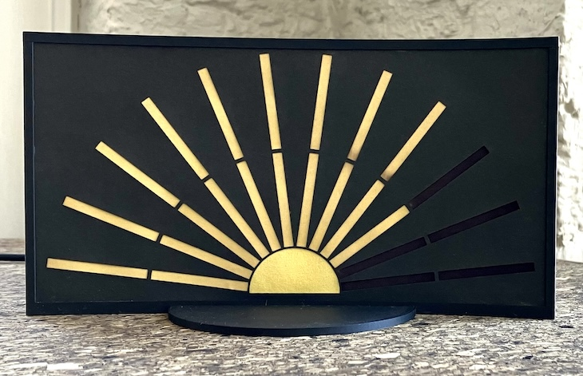
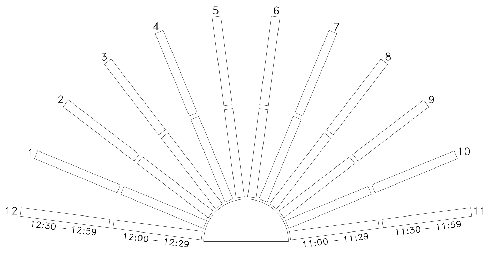
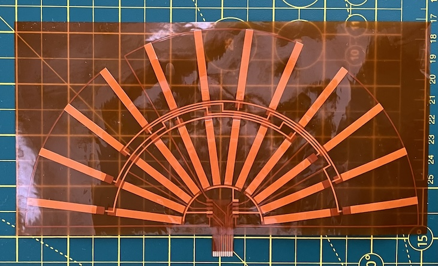
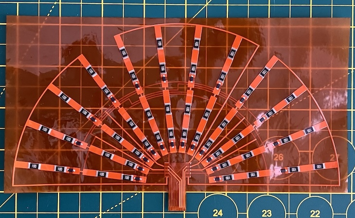
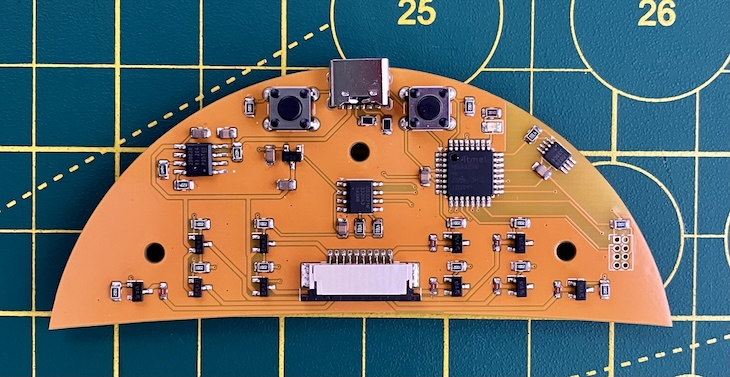
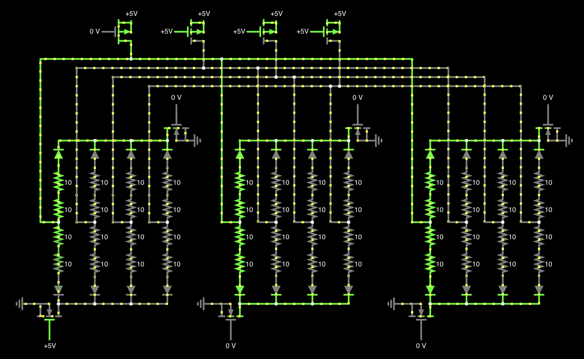
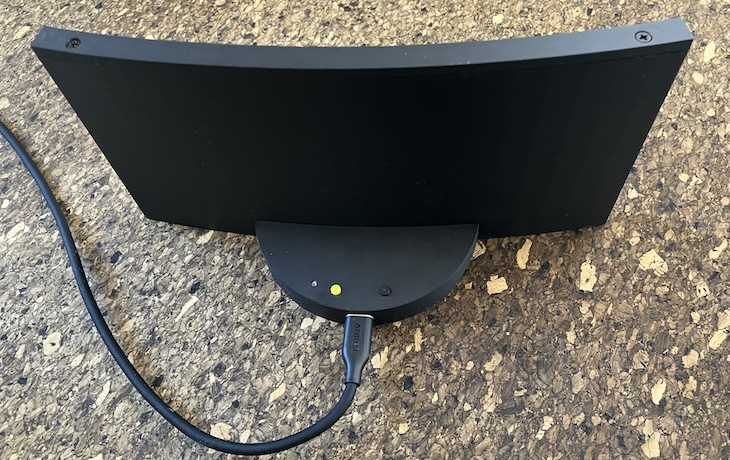
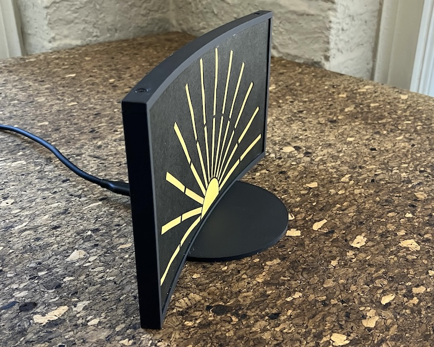
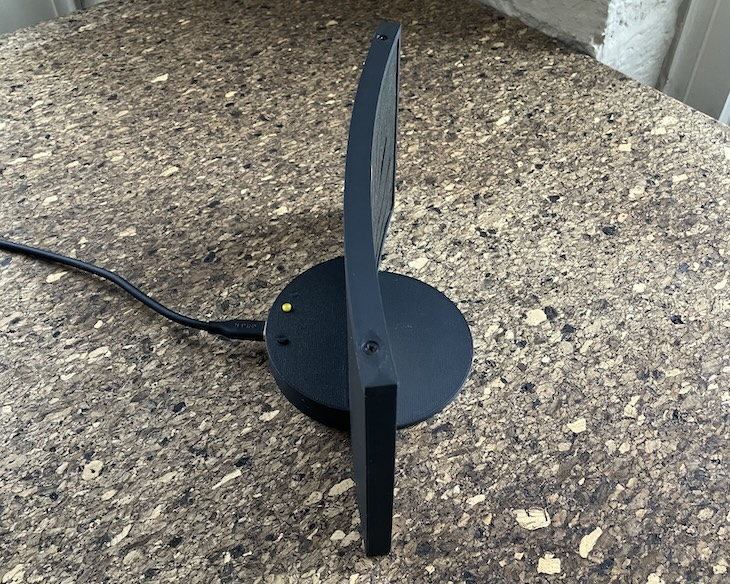
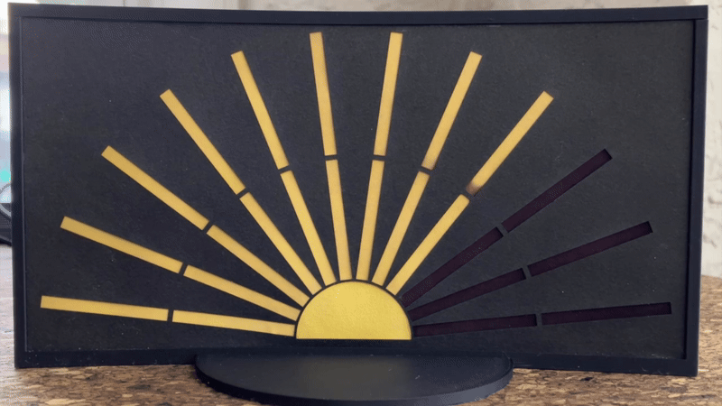

# paper sunshine clock

This project is a clock which tells time in a unique way. The display is made out of paper and uses thermochromic paint which changes color with heat. The face of the display looks like the sun with 12 rays representing 12 o’clock to 11 o’clock, going clockwise, which turn from black to yellow as each hour passes. Each ray is divided up into half hour segments, so the clock is able to tell you the current half hour. For example in the photo above, the clock is reading between 9 o’clock and 9:30. 

It also has Sparkle Mode, which will turn on a random ray every 10 seconds. It provides an entertaining show as the rays turn on and fade away (see [Videos](#Videos) below).

It works by using thermochromic paint screen printed onto a piece of Japanese awagami paper. Behind that, is a flex PCB with large resistors mounted on the back. These resistors can be selectively turned on, warming up the paper and activating the thermochromic paint. 
Each ray on the PCB is a copper pour used to spread and hold heat from the resistors. It was designed using Python and an SVG drawing library, and converted into a KiCad footprint.

The control board is driven by an Atmega328PB and uses a DS3231MZ RTC for accurate time keeping. A coin cell battery is used to keep track of time even when the clock is unpowered. The time is initially set when programming the clock, and can be changed in +/- 30 minute increments using the two buttons on the back.

It uses a multiplexing system which allows the 24 segments to be controlled with 10 connections. The rays of the clock are divided in 3 groups, with 4 rays each. Each group has a top and bottom ground connection connecting the rays (allowing the half hour segments to be individually controlled). The “similar” rays of each group (e.g., the first ray of each group, the second ray of each group, etc) have a shared 5v connection. So for example, to turn on the segment representing the first half hour of 12 o’clock, ground the bottom connection of the first group and apply 5v to the first ray.

For safety (since we’re applying heat to paper here), I used an eFuse to clamp the input voltage at 5v. There are also SMD fuses as a second line of defense. 

In order to keep the rays at the proper temperature (around 90-100 F / 32-38 C), a temperature sensor reads the ambient temperature and will PWM the display to maintain a reasonably consistent temperature. This actually got a bit complicated, since the heat from the display would warm up the back compartment where the control PCB is and influence the temperature sensor. Fortunately, the temperature increases were fairly predicable and could be compensated for. From testing, the clock works well in temperatures between 65-80 F / 18-27 C.

The enclosure was designed in OpenSCAD and is 3D printed.

# Videos

## [Startup sequence](https://www.youtube.com/watch?v=sf5E_oBU3c0)

## [5 minutes of Sparkle Mode in real time](https://www.youtube.com/watch?v=p_eX9BhE4EM)

